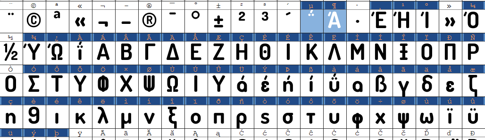

Grim Fandango: Remastered (PC) Unofficial translations
---

This repository contains information on how to create unofficial localizations for the Remastered version of the game as well as provide a source for already made translations.

**Unofficial Grim Fandango: Remastered translations:**

| Language | Status |
|---------|---------------|
| [Greek](translations/greek/README.md)   | Based on unofficial translation of the original game, missing Remastered strings (documentary, extra options) [[More info](translations/greek/README.md)]
| [Russian](translations/russian/README.md) | Complete, based on unofficial translation of the original Game [[More info](translations/russian/README.md)]

***All translations can be found under [translations](translations). Feel free to help out if any translation is missing something.***

To install, simply copy all directory files to the root directory of your Grim Fandango: Remastered game installation.

**Note: Installing any language will overwrite the English language. This has been tested only on the GoG release.**

Patching a new language in Grim Fandango Remastered
----------- 
Grim Fandango Remastered uses plain text files for its dialogue, menu and UI text.
For latin-based languages, adding a translation is as simple as just replacing the text strings in `grim.en.tab` file.

Unfortunately, for other languages, you'll need to add modified font files with proper glyphs.

Note: You can also replace any other language file included, but you won't be able to change the voiceover language to English.

**Requirements:**
- A copy of Grim Fandango: Remastered, GoG version (Steam might also work, not tested.)
- **A way to edit fonts**- for the Greek translation, I used [FontForge](https://fontforge.org/en-US/downloads/).
- Fonts that are compatible with your language, You can use [GoogleFonts](https://fonts.google.com/).

###Steps:

### 1. Add new fonts in directory `FontsHD`

This directory is located in your game installation directory.

Grim Fandango: Remastered uses 4 different font files (and weights)

Inside `FontsHD` you'll find the following files along with some font files (.ttf)
- `FUTURA40.LAF.txt`
- `KINO14S.LAF.txt`
- `KOLOSS100.LAF.txt`
- `KOLOSS52.LAF.txt`
- `KOLOSS69.LAF.txt`
- `MEREDITH38.LAF.txt`
- `MEREDITH46.LAF.txt`
- `OCR10.LAF.txt`
- `TREB13BS.LAF.txt`
      
These files are all single line plain text files, containing what font to be used and its size in pixels.

For example `FUTURA40.LAF.txt` contains:
        
        FuturaStd-Heavy.ttf 40px

I have identified that this file contains the MENU UI font and `TREB13BS.LAF.txt`, the dialogue font.
You shouldn't have any issues if you keep the sizes more or less the same. Unfortunately it's hit-and-miss, but the game handles sizing pretty well.

So in order to change the fonts, you either replace the font files in the directory or change the filename of the font used inside these files.
For the Greek translation I've modified the .txt files.

### 2. Translate strings in `grim.en.tab`

This file is located in your game installation directory. It's a plain text file and contains all strings used in the game. UI/Dialogue/Dialog messages/etc.

In example, a line like this:

        lrma010	If I scare them to death then they'll become a customer, but I'll get nailed with a conflict-of-interest rap.

Can be translated in Greek, as:

        lrma010	Αν τους τρομάξω του θανατά τότε θα γίνουν πελάτες μου, αλλά θα κατηγορηθώ ποινικά για σύγκρουση συμφερόντων.

### 3. Modify the font files to work properly with your language in Grim Fandango

My method was a bit hacky for this part, but it's pretty straightforward.

First, you need to identify which glyphs are being shown instead of your language's glyphs.

**In the Greek translation for instance, the game would show something like this:**

*In order to mend this, we need to figure out which character glyphs we need to replace.* 

If you open the font file associated with the dialogue in [FontForge](https://fontforge.org/en-US/downloads/) you'll notice that the Greek character set, exactly like the latin character set, is stored in alphabetical order inside the font:

The main idea is to figure out at least one character glyph from the game and re-position all the glyphs appropriately.

For instance on screen we saw this:

    Åßìáé ï Calavera. Ï Manny Calavera.

In reality, it should have been:

    Είμαι ο Calavera. Ο Manny Calavera.

This way we know that Å = Ε , and ï = ο. To make this simpler I edited the file and added a dialogue line that contained `ABCDEFGHIJKLMNOPQRSTUVWXYZabcdefghijklmnopqrstuvwxyz1234567890 -=!@#^()_+[]{}|``~;:,.<>?\'\"ΐΑΒΓΔΕΖΗΘΙΚΛΜΝΞΟΠΡ`

Then all I had to do is select the letters in order in FontForge, right click copy and paste exactly where the Ά character started for the Greek character set, like this:

For this specific font , I skipped the · and » characters because they were already correct in place. This doesn't happen for all fonts and certainly not in the lettering part of the character set.

Save your font as .ttf in the `FontsHD` directory, located in your game installation root.

###4. Enjoy! 

History
--
Grim Fandango is a 1998 adventure game directed by Tim Schafer and developed and published by LucasArts for Microsoft Windows. It is the first adventure game by LucasArts to use 3D computer graphics overlaid on pre-rendered static backgrounds. As with other LucasArts adventure games, the player must converse with characters and examine, collect, and use objects to solve puzzles. [Read more at Wikipedia](https://en.wikipedia.org/wiki/Grim_Fandango)

### Localization
No official way exists to localize/translate either the original Grim Fandango or Grim Fandango Remaster.
For the original Grim Fandango game there are [at least 4 other unofficial translations](http://www.grim-fandango.com/downloads.php#translation). (Chinese, Greek, Turkish, Portugese)

The Remastered version of Grim Fandango officially supports English, French, Italian, German and Spanish.

---

### Authors

* **Ioannis (John) Karavas** - *Initial work* - [iokaravas](https://github.com/iokaravas)

See also the list of [contributors](contributors.md) who participated in this project.

---
Grim Fandango is a trademark of Lucas Arts Entertainment Company.
LucasArts is a trademark of Lucasfilm Ltd.

The Greek translation shown, uses fonts created by [Myrto Orfanoudaki - aka-acid.com](https://www.aka-acid.com/)
